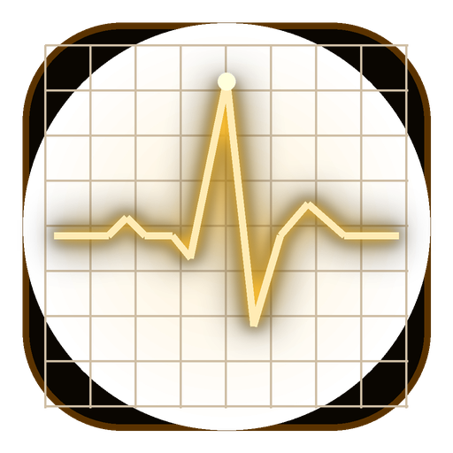

<p align="center">
  
</p>

<h1 align="center">AMBER VITALS // AMBER-01</h1>

<p align="center">
  <strong>Dual-Channel Biomedical CRT Oscilloscope & Telemetry System</strong><br>
  <em>Real-time ECG (AD8232) & Pulse Oximetry (MAX30102) over Nordic UART Service (NUS) BLE</em>
</p>

<p align="center">
  <strong>Engineered & Developed by João V.P.</strong>
</p>

<p align="center">
  
  
  
  
  
  
</p>

---

## 📋 Overview

**Amber Vitals** is a production-grade biomedical monitoring application inspired by vintage clinical phosphor CRT monitors. Pairing an **ESP32-WROOM-32** microcontroller with an **AD8232 ECG front-end** and a **MAX30102 pulse oximeter**, it captures, digitally filters, and streams cardiac biopotentials and optical photoplethysmograms in real time.

Built with a custom hardware-accelerated vector canvas (`CustomPainter`), the app reproduces the aesthetic of hospital bio-scanners — complete with CRT curvature glow, coordinate grid divisions, systolic heart rate pulsing, and automatic sensor failover.

---

## ✨ Key Features

- **Dual-Channel Phosphor CRT Oscilloscope**:
  - **Channel 1 (PPG Wave)**: Real-time photoplethysmogram at 25 mm/s sweep with centered *"PLACE FINGER ON SENSOR"* lead detection alert.
  - **Channel 2 (ECG Wave)**: Clinical-grade electrocardiogram with sharp QRS complexes, P and T waves, and *"LEADS OFF"* electrode disconnect alert.
- **Advanced Digital Signal Processing (DSP)**:
  - **60 Hz IIR Biquad Notch Filter** ($Q \approx 0.92$): Eliminates AC power grid interference (> 30 dB rejection).
  - **35 Hz 2nd-Order Butterworth Low-Pass Filter**: Strips electromyographic (EMG) muscle tremor and high-frequency RF noise.
  - **Adaptive Baseline Wander Subtraction**: Removes low-frequency respiratory drift (< 0.5 Hz) while preserving ST-segment fidelity.
  - **Pan-Tompkins QRS & R-Peak Detection**: Real-time heart rate derivation via 5-point differentiation, non-linear squaring, and moving-window integration (MWI) with a 250 ms refractory period.
- **Smart Physiological Failover**:
  - Main hero readout automatically prioritizes the optical pulse oximeter heart rate and seamlessly falls back to ECG R-peak heart rate if the finger is removed.
- **Nordic UART Service (NUS) Bluetooth Protocol**:
  - Uses the universal Nordic UART profile (`6e400001-...`), enabling instant plug-and-play connection with **Serial Bluetooth Terminal** on Android and any generic BLE scanner without manual UUID setup.
- **Dual View Modes**:
  - **CRT Bioscanner Mode**: Fullscreen retro clinical oscilloscope with terminal log and live uptime clock.
  - **Modular Cards Mode**: Extensible `SensorModule` cards coupled with **Google Gemini AI** for plain-language educational health insights.
- **Synthetic Multi-Gaussian Simulation (Demo Mode)**:
  - Integrated 5-Gaussian mathematical model generating realistic P-QRS-T complexes for hardware-free demonstration and UI testing.

---

## 🧮 Signal Processing & Mathematics

The ESP32 firmware samples the analog ECG channel at **200 Hz** before decimating to **50 Hz** for wireless telemetry transmission:

### 1. 60 Hz Biquad Notch Filter (Direct Form II Transposed)
$$y[n] = b_0 x[n] + b_1 x[n-1] + b_2 x[n-2] - a_1 y[n-1] - a_2 y[n-2]$$
- **Coefficients**: $b = [0.92244, 0.57010, 0.92244]$, $a = [1.0, 0.56859, 0.84640]$

### 2. 35 Hz 2nd-Order Butterworth Low-Pass Filter
- **Coefficients**: $b = [0.16748, 0.33497, 0.16748]$, $a = [1.0, -0.55703, 0.22697]$

### 3. Multi-Gaussian Synthetic ECG Model (Demo Mode)
$$ECG(t) = 2048 + \sum_{k \in \{P, Q, R, S, T\}} A_k \cdot \exp\left(-\frac{(\phi(t) - \mu_k)^2}{2 \sigma_k^2}\right)$$

| Wave Component | Center ($\mu$) | Width ($\sigma$) | Amplitude ($A$) | Physiological Meaning |
| :--- | :---: | :---: | :---: | :--- |
| **P Wave** | 0.18 | 0.035 | $+45$ | Atrial Depolarization |
| **Q Wave** | 0.30 | 0.018 | $-65$ | Septal Depolarization |
| **R Peak** | 0.33 | 0.022 | $+480$ | Ventricular Apical Depolarization |
| **S Wave** | 0.36 | 0.018 | $-130$ | Ventricular Basal Depolarization |
| **T Wave** | 0.55 | 0.070 | $+95$ | Ventricular Repolarization |

---

## 🔌 Hardware Schematics & Pinout

```
  +-------------------------------------------------------------+
  |                      ESP32 DevKit                           |
  |                                                             |
  |  [3V3] --------+--------------------+                       |
  |                | (3.3V)             | (VIN)                 |
  |  [GND] ----+---|----------------+---|                       |
  |            |   | (GND)          |   | (GND)                 |
  |  [GPIO21] -|---|----------------|---|-- SDA (MAX30102)      |
  |  [GPIO22] -|---|----------------|---|-- SCL (MAX30102)      |
  |            |   |                |   |                       |
  |  [GPIO34] -|---|-- OUTPUT (ECG) |   |                       |
  |  [GPIO32] -|---|-- LO+ (AD8232) |   |                       |
  |  [GPIO33] -|---|-- LO- (AD8232) |   |                       |
  +-------------------------------------------------------------+
```

---

## 📡 BLE Protocol Specification

- **Device Name**: `ESP32-BioMonitor`
- **Primary Service (Nordic UART)**: `6e400001-b5a3-f393-e0a9-e50e24dcca9e`
- **TX Characteristic (Notify)**: `6e400003-b5a3-f393-e0a9-e50e24dcca9e`
- **RX Characteristic (Write)**: `6e400002-b5a3-f393-e0a9-e50e24dcca9e`
- **Legacy Service (Fallback)**: `4fafc201-1fb5-459e-8fcc-c5c9c331914b`

### Telemetry Packet Format (50 Hz)
```text
IR,BPM,SPO2,FINGER_OK,ECG,LEADS_OFF,BPM_ECG\n
```

---

## 🚀 Getting Started

### 1. Prerequisites
- [Flutter SDK](https://docs.flutter.dev/get-started/install) (>= 3.24.0)
- [Arduino CLI](https://arduino.github.io/arduino-cli/) with ESP32 board package (`esp32:esp32:esp32`)
- Android device or emulator with Bluetooth 4.2+ support

### 2. Flashing the ESP32 Firmware
```bash
# Compile with huge_app partition table
arduino-cli compile --fqbn esp32:esp32:esp32 --board-options PartitionScheme=huge_app ~/esp32_amber_monitor

# Flash to connected device
arduino-cli upload -p /dev/ttyACM0 --fqbn esp32:esp32:esp32 ~/esp32_amber_monitor
```

### 3. Building the Mobile App
```bash
# Clone the repository
git clone https://github.com/chevalierjvps/amber_vitals.git
cd amber_vitals

# Install Dart dependencies
flutter pub get

# Run on connected Android device or Linux desktop
flutter run

# Or build the standalone release/debug APK
flutter build apk --debug
```

The compiled APK will be located at:
`build/app/outputs/flutter-apk/app-debug.apk`

---

## 👤 Author & Engineering

Designed, engineered, and maintained by:

**João V.P.**
- **GitHub**: [@chevalierjvps](https://github.com/chevalierjvps)
- **Project**: Amber Vitals // AMBER-01 Biotelemetry Unit

---

## 📄 License

This project is licensed under the **MIT License** — see the [LICENSE](LICENSE) file for details.
